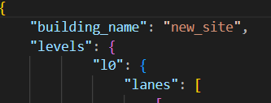
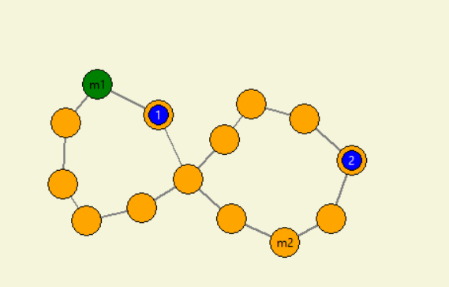
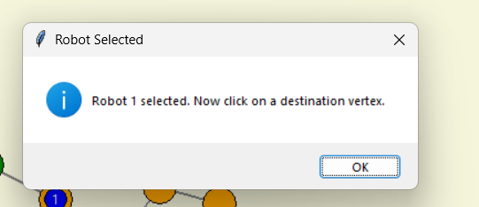
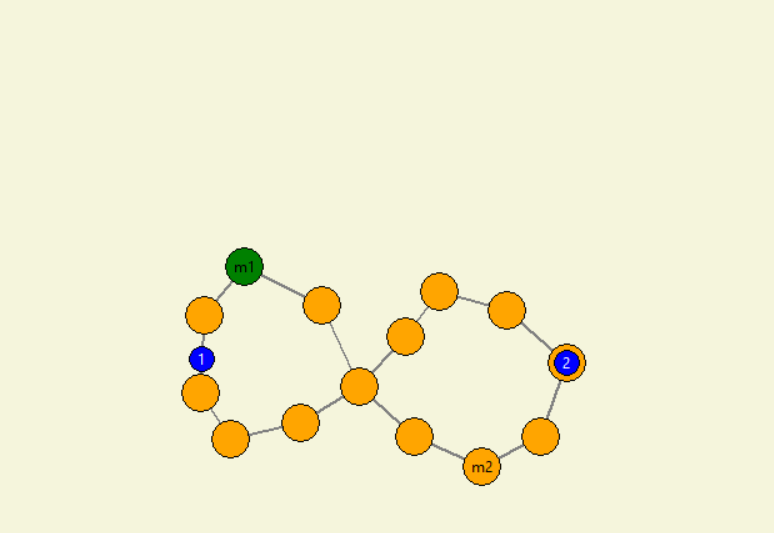
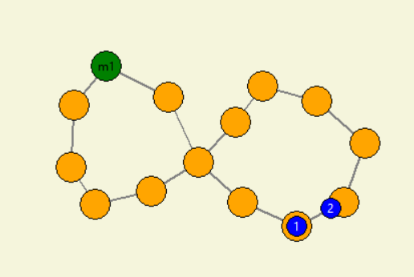
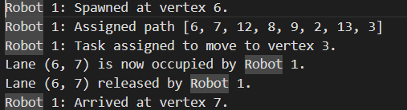

# GoatPSGHackathon_22PC07

1. To load the graph, change the path in main.py:

with open(r"fleet_management_system\data\nav_graph_2.json", "r") as file:
        nav_graph_data = json.load(file)["levels"]["level1"]

in the json.load(file)["levels"]["level1"] change the revelant value mentioned in the json file, for example:

in nav_graph_2.json the values mentioned as levels, l0 

so mention this value in the code json.load(file)["levels"]["l0"]

2. To run the code use the following command:
# Install dependencies
pip install -r requirements.txt
# Run your visual GUI system
python src/main.py

the requirements.txt contians the needed dependency for the program

3. A GUI will pop up

here you can select any vertex to spawn new robot

the robot will be mentioned by robot_id (i.e 1,2,3....), you can spawn multiple robots also you can
spawn robots in real-time without interrupting the navigating robots.

4. To assign task

select the robot you want to assign the task
For example we select robot 1, once selected you will get a message box as

then select the destination vertex, Now the robot moves to the destination

5. Collison avoidance: 

The robot will avoid collision with other robots,
if there is a collision, the robot will stop and wait for the other robot to pass by.

6. Logging & Monitoring:
The system logs all the events in a file named "fleet_logs.txt"
All the robot actions will be logged in fleet_logs.txt 
example:

